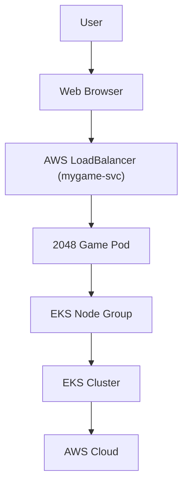

# 🚀 Deploying the 2048 Game on AWS EKS: A Kubernetes Adventure


<p align="center">
  
  
  
  
</p>

---

## 🌟 Why 2048 on EKS?

Deploying the classic 2048 game on Amazon EKS is more than just fun—it's a practical, hands-on way to:
- Master Kubernetes fundamentals
- Learn AWS EKS cluster management
- Practice real-world DevOps workflows
- See your work come alive in the cloud!

---

## 🗺️ Project Architecture



---

## 🛠️ Prerequisites

- **kubectl**: Command-line tool for managing Kubernetes clusters. [Install Guide](https://kubernetes.io/docs/tasks/tools/)
- **eksctl**: CLI for creating and managing EKS clusters. [Install Guide](https://eksctl.io/introduction/installation/)
- **AWS CLI**: Interface for AWS services, including EKS. [Install Guide](https://docs.aws.amazon.com/cli/latest/userguide/getting-started-install.html)

---

## 🎮 Project Overview

This project guides you through deploying the 2048 game on Amazon EKS using Kubernetes. You'll containerize, set up your cluster, deploy, scale, and expose your app to the world—all in the cloud!

---

## 🚦 Quick Start

1. **Provision EKS Cluster**
   - Set up networking, IAM, and security groups.
   - 
2. **Configure IAM Roles**
   - Attach necessary policies for cluster and node groups.
   - 
3. **Add Node Groups**
   - Add worker nodes for your pods.
   - 
4. **Authenticate kubectl**
   - Update kubeconfig and verify node access:
     ```sh
     aws eks update-kubeconfig --region <region> --name <cluster-name>
     kubectl get nodes
     ```
5. **Deploy the 2048 Game Pod**
   - Apply the pod manifest:
     ```sh
     kubectl apply -f 2048-pod.yaml
     kubectl get pods
     ```
6. **Expose with LoadBalancer**
   - Apply the service manifest:
     ```sh
     kubectl apply -f mygame-svc.yaml
     kubectl describe svc mygame-svc
     ```
   - Access the game via the LoadBalancer DNS after a few minutes.
   - 

---

## 📦 Kubernetes Manifests

- `2048-pod.yaml`: Pod definition for the 2048 game
- `mygame-svc.yaml`: Service definition to expose the game

---

## 🧩 Troubleshooting & Tips

- **Pod not running?**
  - Check pod status: `kubectl describe pod 2048-pod`
  - View logs: `kubectl logs 2048-pod`
- **Service not accessible?**
  - Ensure your security group allows inbound traffic on port 80.
  - Wait a few minutes for the LoadBalancer to provision.
- **Cluster issues?**
  - Double-check IAM roles and permissions.
  - Use `kubectl get events` for real-time cluster feedback.

---

## 💡 About This Project

This project was created as a hands-on DevOps and cloud-native learning experience. Whether you're new to Kubernetes or looking to sharpen your AWS skills, deploying 2048 on EKS is a fun and practical way to level up.

---

> **Feedback and suggestions are always welcome!** # 🚀 Deploying the 2048 Game on AWS EKS: A Kubernetes Adventure


<p align="center">
  
  
  
  
</p>

---

## 🌟 Why 2048 on EKS?

Deploying the classic 2048 game on Amazon EKS is more than just fun—it's a practical, hands-on way to:
- Master Kubernetes fundamentals
- Learn AWS EKS cluster management
- Practice real-world DevOps workflows
- See your work come alive in the cloud!

---

## 🗺️ Project Architecture


---

## 🛠️ Prerequisites

- **kubectl**: Command-line tool for managing Kubernetes clusters. [Install Guide](https://kubernetes.io/docs/tasks/tools/)
- **eksctl**: CLI for creating and managing EKS clusters. [Install Guide](https://eksctl.io/introduction/installation/)
- **AWS CLI**: Interface for AWS services, including EKS. [Install Guide](https://docs.aws.amazon.com/cli/latest/userguide/getting-started-install.html)

---

## 🎮 Project Overview

This project guides you through deploying the 2048 game on Amazon EKS using Kubernetes. You'll containerize, set up your cluster, deploy, scale, and expose your app to the world—all in the cloud!

---

## 🚦 Quick Start

1. **Provision EKS Cluster**
   - Set up networking, IAM, and security groups.
   - 
2. **Configure IAM Roles**
   - Attach necessary policies for cluster and node groups.
   - 
3. **Add Node Groups**
   - Add worker nodes for your pods.
   - 
4. **Authenticate kubectl**
   - Update kubeconfig and verify node access:
     ```sh
     aws eks update-kubeconfig --region <region> --name <cluster-name>
     kubectl get nodes
     ```
5. **Deploy the 2048 Game Pod**
   - Apply the pod manifest:
     ```sh
     kubectl apply -f 2048-pod.yaml
     kubectl get pods
     ```
6. **Expose with LoadBalancer**
   - Apply the service manifest:
     ```sh
     kubectl apply -f mygame-svc.yaml
     kubectl describe svc mygame-svc
     ```
   - Access the game via the LoadBalancer DNS after a few minutes.
   - 

---

## 📦 Kubernetes Manifests

- `2048-pod.yaml`: Pod definition for the 2048 game
- `mygame-svc.yaml`: Service definition to expose the game

---

## 🧩 Troubleshooting & Tips

- **Pod not running?**
  - Check pod status: `kubectl describe pod 2048-pod`
  - View logs: `kubectl logs 2048-pod`
- **Service not accessible?**
  - Ensure your security group allows inbound traffic on port 80.
  - Wait a few minutes for the LoadBalancer to provision.
- **Cluster issues?**
  - Double-check IAM roles and permissions.
  - Use `kubectl get events` for real-time cluster feedback.

---

## 💡 About This Project

This project was created as a hands-on DevOps and cloud-native learning experience. Whether you're new to Kubernetes or looking to sharpen your AWS skills, deploying 2048 on EKS is a fun and practical way to level up.

---

> **Feedback and suggestions are always welcome!** 
